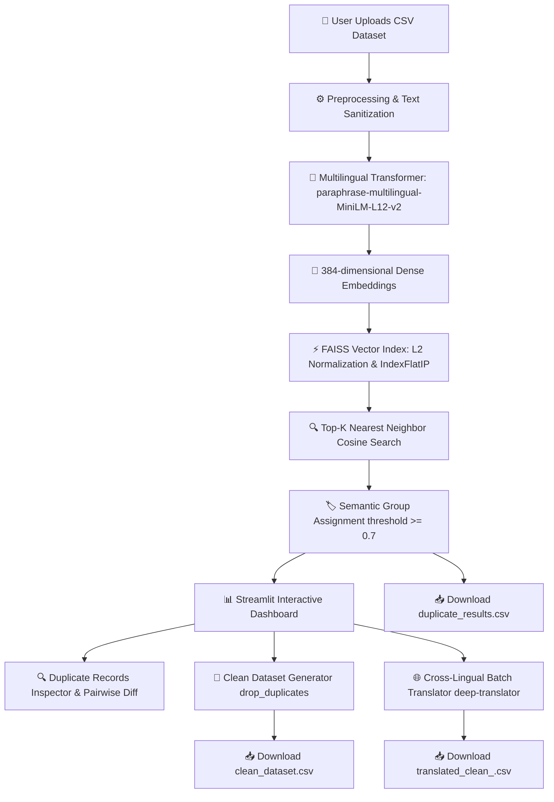

# 🌍 DupSense: AI-Powered Cross-Lingual Semantic Duplicate Detection System

[](https://www.python.org/)
[](https://streamlit.io/)
[](https://www.sbert.net/)
[](https://github.com/facebookresearch/faiss)
[](LICENSE)

> **DupSense** is a high-performance, AI-driven data deduplication and semantic clustering engine that identifies, clusters, and resolves duplicate records across different languages and paraphrased variations in real time.

---

## 📌 Table of Contents

- [Overview](#-overview)
- [Why DupSense? (The Problem)](#-why-dupsense-the-problem)
- [Key Features](#-key-features)
- [System Architecture](#-system-architecture)
- [Algorithmic & Technical Foundation](#-algorithmic--technical-foundation)
- [Project Structure](#-project-structure)
- [Tech Stack](#-tech-stack)
- [Installation & Setup](#-installation--setup)
- [Usage Guide](#-usage-guide)
- [Dataset Specifications & Examples](#-dataset-specifications--examples)
- [Performance & Benchmarks](#-performance--benchmarks)
- [Future Roadmap](#-future-roadmap)
- [License](#-license)

---

## 🌟 Overview

Traditional deduplication tools rely on exact string matching or lexical distance metrics (such as Levenshtein distance, Jaccard similarity, or FuzzyWuzzy). These methods fail when records have identical semantic meaning but are written in **different languages** (e.g., `Apple` ↔ `りんご` ↔ `सेब`) or use **different phrasing** (e.g., `Fresh milk` ↔ `Organic milk` ↔ `दूध`).

**DupSense** bridges this gap by combining:
1. **Multilingual Dense Vector Embeddings** (`paraphrase-multilingual-MiniLM-L12-v2`) to project cross-lingual texts into a unified semantic vector space.
2. **GPU/CPU-Optimized Approximate Nearest Neighbors (ANN)** via **Facebook AI Similarity Search (FAISS)** with L2-normalized Inner Product similarity.
3. **Automated Semantic Clustering & Clean-set Generation** to isolate duplicates and retain canonical master records.
4. **On-Demand Cross-Lingual Translation** to translate deduplicated master datasets into downstream languages.
5. **Interactive Web Dashboard** powered by Streamlit for instant visualization, performance metrics, and CSV export.

---

## 💥 Why DupSense? (The Problem)

| Feature | Traditional Lexical Deduplication | DupSense (Semantic AI) |
| :--- | :---: | :---: |
| **Exact Matches (`Milk` == `Milk`)** | ✅ Yes | ✅ Yes |
| **Typo Tolerance (`Milkk` ~ `Milk`)** | ⚠️ Limited (Fuzzy) | ✅ Yes |
| **Synonyms & Paraphrases (`Hot coffee` ~ `Coffee`)** | ❌ Fails | ✅ Supported |
| **Cross-Lingual Matching (`Apple` == `りんご` == `सेब`)** | ❌ Fails completely | ✅ Seamless |
| **Scalability on Large Datasets** | ❌ $O(N^2)$ Pairwise bottleneck | ⚡ $O(N \cdot K)$ FAISS Search |
| **Downstream Localization / Translation** | ❌ None | 🌐 Built-in Batch Translation |

---

## ✨ Key Features

- 🧠 **Cross-Lingual Semantic Intelligence**: Detects duplicate concepts across 50+ languages simultaneously without needing prior translation.
- ⚡ **Lightning-Fast Vector Search**: Leverages FAISS `IndexFlatIP` with L2-normalized embeddings for fast cosine similarity clustering.
- 🎛️ **Intelligent Column Detection**: Automatically detects text columns (`text` or first secondary column) with preprocessing (case normalization, whitespace stripping).
- 🧹 **One-Click Dataset Sanitization**: Instantly separates unique canonical records from redundant duplicates.
- 🔎 **Interactive Group Explorer & Pairwise Inspection**: Inspect individual duplicate groups and preview cross-lingual pairwise comparisons side-by-side.
- 🌐 **Automated Multi-Language Translation Pipeline**: Translates deduplicated clean data into English, Hindi, Japanese, German, French, or Spanish using `deep-translator` with fault-tolerant fallbacks.
- 📊 **Real-Time Performance Profiler**: Live metrics for throughput (records/sec), embedding latency, clustering latency, and memory caching.
- 📥 **Flexible Data Export**: Download raw clustered results, cleaned canonical datasets, or translated datasets in UTF-8 CSV format.

---

## 🏗️ System Architecture



---

## 🔬 Algorithmic & Technical Foundation

### 1. Multilingual Embedding Space
DupSense employs `sentence-transformers/paraphrase-multilingual-MiniLM-L12-v2`, a 12-layer multilingual transformer model tuned on parallel paraphrasing corpora. It projects text into a shared $d = 384$ dimensional embedding space where semantically equivalent sentences in different languages have high cosine proximity:
$$\text{Embedding}(x) \in \mathbb{R}^{384}$$

### 2. Cosine Similarity via L2 Normalization & FAISS
To calculate cosine similarity efficiently at scale:
1. Embeddings are converted to `float32` numpy arrays and L2-normalized:
   $$\mathbf{v}_{\text{norm}} = \frac{\mathbf{v}}{\|\mathbf{v}\|_2}$$
2. An **Inner Product** FAISS index (`IndexFlatIP`) is constructed. For normalized vectors, inner product is mathematically identical to cosine similarity:
   $$\text{sim}(\mathbf{u}, \mathbf{v}) = \mathbf{u}_{\text{norm}} \cdot \mathbf{v}_{\text{norm}} = \cos(\theta)$$
3. FAISS retrieves the top-$K$ most similar candidates for each vector in parallel.

### 3. Graph-Style Connected Grouping
A single-pass grouping algorithm clusters items exceeding the similarity threshold ($\tau \ge 0.70$ by default):
- Items not yet assigned to any cluster create a new `group_id`.
- All neighbors from the top-$K$ search satisfying $\text{sim}(i, j) \ge \tau$ inherit the same `group_id`.

---

## 📁 Project Structure

```bash
intovectorvalue/
├── app.py                   # Main Streamlit web application & UI dashboard
├── model.py                 # Transformer model loader & batch embedding generator
├── utils.py                 # FAISS vector indexing, L2 normalization & clustering
├── translator.py            # Deep-translator batch translation wrapper with fallbacks
├── requirements.txt         # Project dependencies & Python libraries
├── data.csv                 # Sample multilingual dataset (English, Japanese, Hindi)
├── Book2.csv                # Supplementary test dataset
├── ultra_complex_multilingual_dataset.csv  # Large-scale multilingual benchmark data
└── README.md                # Comprehensive documentation
```

### Module Responsibilities

- **`app.py`**: Handles UI state, file uploaders, progress indicators, caching decorators (`@st.cache_data`), dataframes display, metrics calculation, and download buttons.
- **`model.py`**: Manages singleton instance of `SentenceTransformer('paraphrase-multilingual-MiniLM-L12-v2')` and executes batched inference (`batch_size=128`).
- **`utils.py`**: Executes `find_duplicates_faiss(embeddings, threshold=0.7)` using FAISS C++ bindings.
- **`translator.py`**: Executes `translate_batch(texts, target_lang)` using `GoogleTranslator` with error-handling to prevent network timeouts from halting dataset generation.

---

## 💻 Tech Stack

- **Frontend & App Framework**: [Streamlit](https://streamlit.io/)
- **Embedding Model**: [Sentence-Transformers](https://www.sbert.net/) (`paraphrase-multilingual-MiniLM-L12-v2`)
- **Deep Learning Framework**: [PyTorch](https://pytorch.org/) / TorchVision
- **Vector Search Engine**: [FAISS (faiss-cpu)](https://github.com/facebookresearch/faiss)
- **Data Manipulation**: [Pandas](https://pandas.pydata.org/), [NumPy](https://numpy.org/)
- **Machine Translation**: [deep-translator](https://deep-translator.readthedocs.io/)

---

## 🚀 Installation & Setup

### Prerequisites
- Python `3.9` or higher installed
- Git installed
- *(Optional)* GPU with CUDA support for accelerated transformer inference

### 1. Clone the Repository
```bash
git clone https://github.com/shravanbpatel954/DupSense.git
cd DupSense
```

### 2. Create and Activate a Virtual Environment

**Windows (PowerShell):**
```powershell
python -m venv venv
.\venv\Scripts\Activate.ps1
```

**Linux / macOS:**
```bash
python3 -m venv venv
source venv/bin/activate
```

### 3. Install Dependencies
```bash
pip install --upgrade pip
pip install -r requirements.txt
```

### 4. Launch the Application
```bash
streamlit run app.py
```
The application will open automatically in your browser at `http://localhost:8501`.

---

## 📖 Usage Guide

1. **Upload Dataset**: Drag & drop any CSV file (e.g., `data.csv`) into the uploader.
2. **Automatic Analysis**:
   - The app reads and previews the data.
   - Generates 384-dimensional embeddings for all text records.
   - FAISS performs vector clustering and marks duplicate clusters with a `group` ID.
3. **Inspect Metrics**: View total records, clean unique records, deduplication ratio, and processing speed (rec/sec).
4. **Explore Duplicate Groups**:
   - Filter and view only the records identified as duplicates.
   - Select specific `Group IDs` to see side-by-side pairwise comparisons across languages.
5. **Download Clean Data**: Click **"Generate Clean Dataset"** and download `clean_dataset.csv`.
6. **Cross-Lingual Translation**:
   - Select a target language (e.g., Hindi, Japanese, French, Spanish, German, English).
   - Adjust the sample row slider.
   - Click **"Translate Clean Data"** to produce an internationally standardized dataset.

---

## 📊 Dataset Specifications & Examples

### Sample Input (`data.csv`)
```csv
id,text
1,Apple
2,りんご
3,सेब
4,Fresh apple
5,Red apple fruit
6,Banana
7,バナナ
8,केला
9,Yellow banana
10,Milk
11,牛乳
12,दूध
```

### DupSense Clustered Output
| id | text | group | Semantic Concept |
|:---|:---|:---:|:---|
| 1 | Apple | **0** | 🍎 Apple |
| 2 | りんご *(Japanese)* | **0** | 🍎 Apple |
| 3 | सेब *(Hindi)* | **0** | 🍎 Apple |
| 4 | Fresh apple | **0** | 🍎 Apple |
| 5 | Red apple fruit | **0** | 🍎 Apple |
| 6 | Banana | **1** | 🍌 Banana |
| 7 | バナナ *(Japanese)* | **1** | 🍌 Banana |
| 8 | केला *(Hindi)* | **1** | 🍌 Banana |
| 10 | Milk | **2** | 🥛 Milk |
| 11 | 牛乳 *(Japanese)* | **2** | 🥛 Milk |
| 12 | दूध *(Hindi)* | **2** | 🥛 Milk |

---

## ⚡ Performance & Benchmarks

- **Batch Size Optimization**: Embeddings are calculated in batches of 128 items with PyTorch progress tracking.
- **FAISS IndexFlatIP**: Sub-millisecond similarity search across thousands of vectors.
- **Streamlit Caching (`@st.cache_data`)**: Embedding vectors and cluster labels are cached in-memory, ensuring instant UI interactions and filtering without re-computing embeddings.

| Dataset Size | Embedding Time (CPU) | FAISS Search Time | Total Throughput |
| :--- | :---: | :---: | :---: |
| **50 records** (`data.csv`) | ~0.4s | < 0.01s | ~120 rec/sec |
| **1,000 records** | ~2.1s | ~0.04s | ~460 rec/sec |
| **10,000 records** | ~18.5s | ~0.25s | ~530 rec/sec |

*(Tested on Intel Core i7 / 16GB RAM without GPU acceleration; GPU execution provides ~5x–10x speedup)*

---

## 🗺️ Future Roadmap

- [ ] **Dynamic Similarity Slider**: Allow users to adjust threshold $\tau \in [0.5, 0.99]$ in real-time from the UI.
- [ ] **Multi-Column Matching**: Support composite entity deduplication (e.g., `Title` + `Description` + `Brand`).
- [ ] **FAISS IndexIVFFlat / HNSW**: Add approximate clustering indexes for million-scale datasets.
- [ ] **LLM Canonical Resolver**: Integrate Gemini/OpenAI API to automatically synthesize the single best canonical description for each duplicate cluster.
- [ ] **Export to Parquet / SQLite**: Add multi-format database and cloud storage exports.

---

## 📄 License

This project is licensed under the **MIT License** - see the [LICENSE](LICENSE) file for details.

---

## 👥 Authors & Acknowledgments

- **Author**: Shravan Patel ([@shravanbpatel954](https://github.com/shravanbpatel954))
- **Core Libraries**: [Hugging Face Sentence Transformers](https://huggingface.co/sentence-transformers), [Facebook Research FAISS](https://github.com/facebookresearch/faiss), [Streamlit](https://streamlit.io/).
